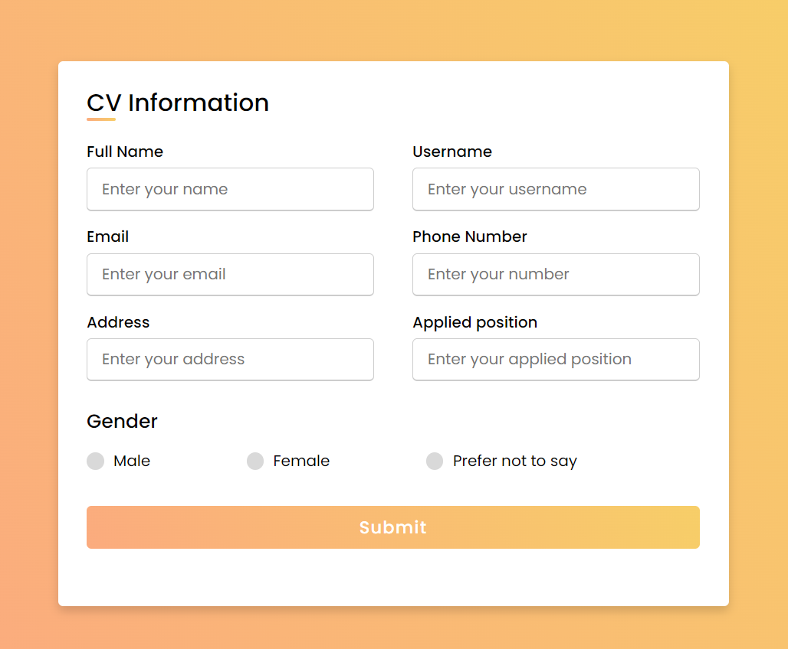
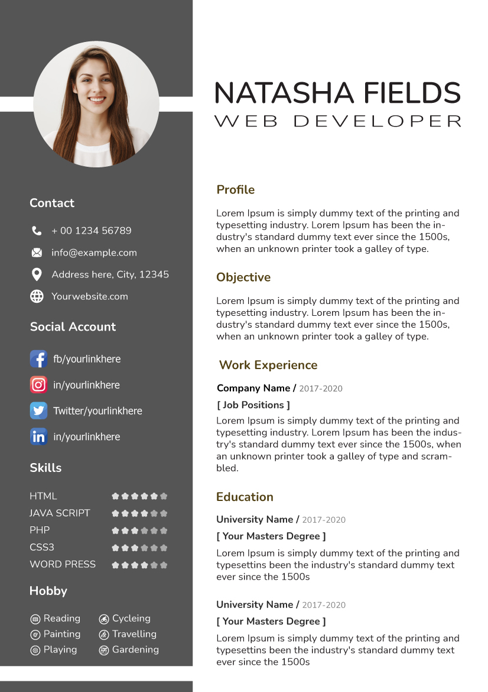

### Hoàn thành form điền thông tin sau đây:
- Đầy đủ các trường có trong form.
- Giao diện giống ảnh.
- Responsive.

### Hoàn thành CV HTML sau đây
(Cố gắng hoàn thành CV trong phạm vi bài tập này - bài tập tiếp theo sẽ áp dụng một số CSS nâng cao ).
- Responsive
- Các trường tương tự trong form là bắt buộc.
- Có thể thêm các thông tin khác như kinh nghiệm làm việc, .... 

## Lưu ý, sản phẩm cần giống hệt Design, code thuần không dùng thư viện bootstrap,...
