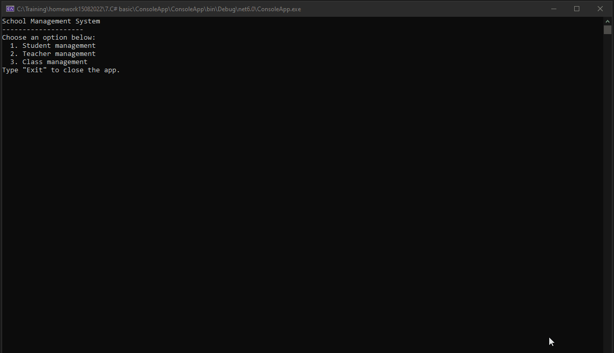

## Hoàn thành Console App với các yêu cầu sau
* Tạo project console application trên Visual Studio.
* Tạo 3 class **Student**, **Class**, **Teacher** với các trường tương ứng:
    - **Student**: Id, Name, Gender, Email, PhoneNumber, Score, ClassId
    - **Teacher**: Id, Name
    - **Class**: Id, Name, TeacherId

### Xây dựng bảng menu chức năng cho app.
- Chọn 1 để thao tác với đối tượng Student.
- Chọn 2 để thao tác với  đối tượng Teacher.
- Chọn 3 để thao tác với đối tượng Class.
* Trong mỗi menu đối tượng:
- Chọn 1 để xem danh sách
- Chọn 2 để tìm kiếm đối tượng
- Chọn 3 để thêm đối tượng
- Chọn 4 để sửa đối tượng
- Chọn 5 để xóa đối tượng
- Chọn 0 để quay lại menu trước.

* Xây dựng chức năng tương ứng với từng options menu.
### Nâng cao
1. Bổ sung tính năng lọc các sinh viên cùng lớp
2. Bổ sung tính năng tìm tất cả các sinh viên của một giáo viên
3. Ghi log vào file bao gồm các hành động người dùng: Thời gian,thông tin đối tượng bị thêm,sửa,xóa.
4. Phân chia cấu trúc thư mục file rõ ràng, coding convention.

### Lưu ý
* Video demo tính năng: 
