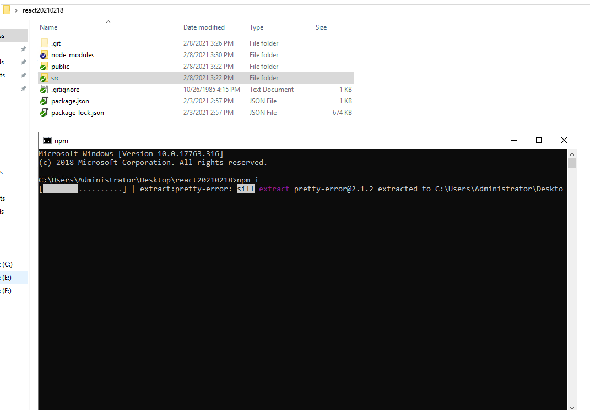

# Assignment

## Outcomes
In this assignment, you will build a webpage with React together.
[Here is the design page](https://xd.adobe.com/view/3b1d0ea3-ec2e-4420-a46c-c22d14d4e60f-6e4e/specs/). The whole page is divided into 6 divisions. Please choose at least 4 of them to finish.

- Announcement & News

- Image Callery & Video Gallery

- Document Gallery

- Quick Links

- Events

- How Do I

 ## Requirements
- Following the details of design page
- Using component thoughts(Class Component).
- Using TypeScript.
- Using SCSS
- Adapting all devices better
- Complete at least 4 webparts(**How Do I** is a **MUST** have).
- If you still have time after you finish the 4 webparts, add the other 2 into your project also.
- **Make Sure** you finished the functions and styles in the demo before you add customizations or improvements.

## Preparation
- Install Node
  The version must be 10.22.1, you can find installation package from https://nodejs.org/dist/v10.22.1/
- Install VS Code

## How to start the project
This project is based on "Create React App"(An official recommend way to start building a new single-page application), you can quickly set up your development environment with following steps.

1. Clone the code from git
2. Under the file you cloned, open cmd window, run **npm i**, then it will take a while to download packages 

3. After finishing, run **npm start**, service will host on **http://localhost:3000/** automatically.

4. Enjoy coding! The page will automatically reload if you make changes to the code.

### For run TypeScript Project
Go to EnvironmentForTypeScript folder, 
- Run **npm i**, then it will take a while to download packages
- In case you failed when install packages, you can try another version of nodeJS (8.1.4 / 16.17.0)
- After finishing, run **npm start**, service will host on **http://localhost:3000/** automatically.
- Change code from JavaScript to TypeScript.
- You guys can code directly in this folder.
